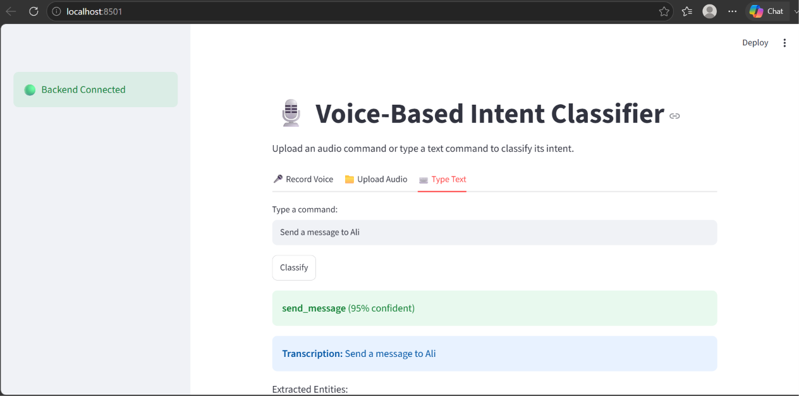
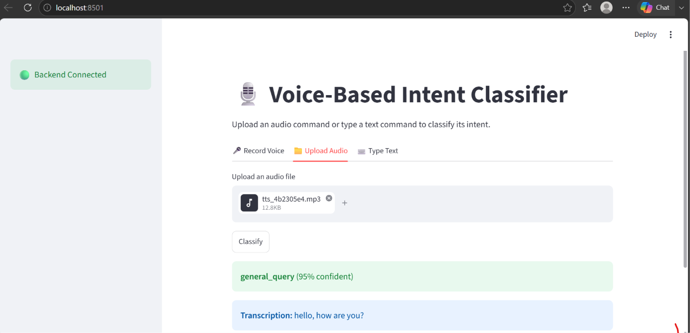
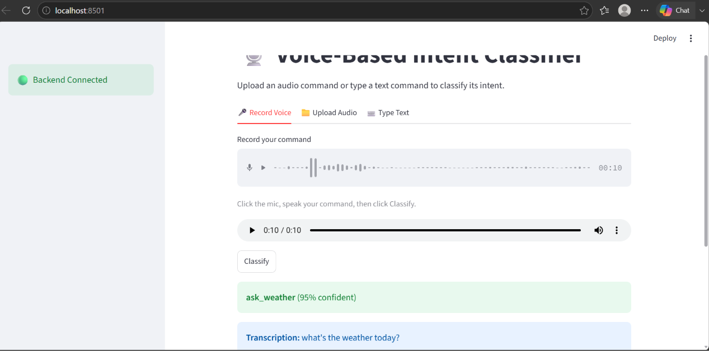

# Voice-Based Intent Classifier

## 1. Project Overview
The Voice-Based Intent Classifier is an end-to-end AI application that listens to a spoken or typed command, transcribes it (when audio), classifies the underlying user intent, and extracts relevant entities/parameters from it. It is designed as a foundational understanding layer for voice assistants, smart‑home command systems, or conversational AI agents — enabling any downstream system to know *what the user wants* before deciding *how to respond*.

## 2. Problem Statement
Most voice-driven applications rely on expensive, always‑online cloud NLU (Natural Language Understanding) services to determine user intent, which increases cost, latency, and privacy concerns. There is a need for a lightweight, easily pluggable intent classification system that reliably maps spoken or typed commands to a predefined set of intents and extracts the relevant details from them.

## 3. Objectives
- Build an end‑to‑end voice/text → intent → entities pipeline.
- Support both live microphone input, uploaded audio files, and direct text input.
- Classify commands into a predefined set of intents with a confidence score.
- Extract key entities/slots from each command (e.g., time, recipient, song name).
- Gracefully fall back to `unknown_intent` for low‑confidence or ambiguous commands instead of guessing.
- Keep the backend modular, testable, and easy to extend with new intents.

## 4. Features Implemented
- **Speech‑to‑Text (STT):** Local transcription using `faster‑whisper`.
- **Intent Classification:** LLM‑based zero‑shot classification via the Groq API.
- **Entity Extraction:** Rule‑based/regex extraction, tailored per intent.
- **Confidence Scoring & Fallback:** Low‑confidence predictions are returned as `unknown_intent` with a clear message instead of a forced guess.
- **Audio Inputs:** Live microphone recording (`st.audio_input`) and file uploads (`.wav`, `.mp3`, `.m4a`, `.ogg`).
- **Text Input:** Direct text classification, bypassing STT entirely.
- **API Backend:** RESTful FastAPI backend with three endpoints (health, classify‑audio, classify‑text).
- **Interactive UI:** Streamlit frontend with three input tabs (Record Voice, Upload Audio, Type Text) and a live backend‑health indicator.
- **Dataset & Evaluation:** A hand‑built, balanced 254‑row labeled dataset across 6 intents plus hard‑negative/ambiguous examples, an 80/20 stratified train/test split, and an automated evaluation script reporting accuracy, precision/recall, and a confusion matrix.

## 5. Screenshots

*Classifying a typed command ("Send a message to Ali") — correctly predicted as `send_message` with 95% confidence.*


*Classifying an uploaded audio file — transcribed and correctly predicted as `general_query`.*


*Live microphone recording ("What's the weather today?") — transcribed and correctly predicted as `ask_weather` with 95% confidence.*

## 6. Technology Stack
- **Frontend:** Streamlit
- **Backend:** FastAPI (Python 3.12+)
- **Speech‑to‑Text:** faster‑whisper (CPU, int8)
- **Intent Classification:** Groq API (`openai/gpt‑oss‑20b`) — LLM‑based zero‑shot classification
- **Entity Extraction:** Rule‑based/regex, implemented per intent
- **Dataset Tooling:** pandas, scikit‑learn (stratified train/test split)
- **Testing:** Pytest

## 7. System Architecture / Workflow
User Input (Voice Record / Audio Upload / Text) ↓ Streamlit Frontend ↓ HTTP POST `/api/v1/classify-audio` (or `/classify-text`) ↓ FastAPI Backend (Orchestrator) ↓ Speech‑to‑Text (faster‑whisper) — for voice input only ↓ Intent Classification (Groq LLM, zero‑shot) ↓ Confidence Threshold Check (0.6 cutoff → `unknown_intent`) ↓ Entity/Slot Extraction (rule‑based, per intent) ↓ Structured Response: `{intent, confidence, entities, transcription}`

## 8. Project Folder Structure
```
Voice-based-intent-classifier/
├── .env.example
├── .gitignore
├── README.md
├── Documentation.md
├── requirements.txt
├── pytest.ini
├── data/
│   ├── intents_dataset.csv   # training set (80%)
│   └── test_set.csv          # held‑out test set (20%)
├── scripts/
│   ├── split_dataset.py      # stratified 80/20 split
│   └── evaluate.py           # accuracy/precision/recall/confusion matrix
├── app/
│   ├── main.py
│   ├── config.py
│   ├── api/
│   │   ├── dependencies.py
│   │   └── v1/
│   │       ├── router.py
│   │       └── classification.py
│   ├── core/
│   │   └── orchestrator.py
│   ├── models/
│   │   └── schemas.py
│   ├── services/
│   │   ├── stt_service.py
│   │   ├── intent_service.py
│   │   └── entity_service.py
│   └── utils/
│       ├── audio.py
│       └── logger.py
├── frontend/
│   └── app.py
├── screenshots/
│   ├── text_input_result.png
│   ├── upload_audio_result.png
│   └── record_voice_result.png
└── tests/
    ├── unit/
    │   ├── test_entity_service.py
    │   ├── test_intent_service.py
    │   └── test_stt_service.py
    └── integration/
        └── test_classification_api.py
```

## 9. Installation & Setup
1. **Clone the repository:**
   ```bash
   git clone https://github.com/Hafiza-Amna/Voice-based-intent-classifier.git
   cd Voice-based-intent-classifier
   ```
2. **Create and activate a virtual environment:**
   ```bash
   python -m venv .venv
   # Windows
   .venv\Scripts\activate
   # Linux/macOS
   source .venv/bin/activate
   ```
3. **Install dependencies:**
   ```bash
   pip install -r requirements.txt
   ```
4. **Copy the environment template and add your Groq API key:**
   ```bash
   copy .env.example .env   # Windows
   # or
   cp .env.example .env     # Linux/macOS
   ```
   Then edit `.env` and set `GROQ_API_KEY=your_key_here` (get a free key at https://console.groq.com).

## 10. Environment Requirements
- Python 3.12 or higher.
- A functional microphone for live voice recording (browser permission required).
- Internet connectivity (required for Groq API calls).
- A free Groq API key.

## 11. Environment Variables
The application uses a `.env` file for configuration (never committed — see `.gitignore`):
- `APP_NAME`, `APP_VERSION`: General application info.
- `HOST`, `PORT`: FastAPI server bindings (default `0.0.0.0:8000`).
- `MAX_AUDIO_FILE_SIZE_MB`: Maximum accepted audio upload size (default `10`).
- `CONFIDENCE_THRESHOLD`: Cutoff below which a prediction becomes `unknown_intent` (default `0.6`).
- `GROQ_API_KEY`: Your Groq API key (required, keep secret).

## 12. How to Run
**1. Start the FastAPI backend:**
```bash
python -m uvicorn app.main:app --reload
```
**2. Start the Streamlit frontend (in a separate terminal):**
```bash
streamlit run frontend/app.py
```
The app opens at `http://localhost:8501`, with the backend running at `http://localhost:8000`.

## 13. Model / Algorithm Explanation
- **Speech‑to‑Text (faster‑whisper):** A CTranslate2‑based reimplementation of OpenAI's Whisper, run locally on CPU (`base` model, `int8` compute) for fast, reasonably accurate transcription.
- **Intent Classification (Groq / `openai/gpt‑oss‑20b`):** A carefully engineered system prompt describes all 6 intents and their distinguishing signals; the model returns a strict JSON object with the predicted intent and a confidence score. Predictions below the 0.6 confidence threshold are overridden to `unknown_intent`.
- **Entity Extraction (rule‑based/regex):** Each intent has its own extraction logic (e.g., time‑pattern matching for `set_alarm`, "to/tell <name>" pattern matching for `send_message`), returning both found entities and a list of any missing required entities.

## 14. Dataset & Model Details
- **Dataset size:** 254 labeled examples across 6 intents (`set_alarm`, `play_music`, `ask_weather`, `translate_text`, `send_message`, `general_query`), including hard‑negative examples (look‑alike commands from a different true intent) and ambiguous examples labeled `unknown_intent`.
- **Split:** 80/20 stratified train/test split (203 training rows, 51 test rows), preserving per‑intent balance, via `scripts/split_dataset.py`.
- **No custom model training:** Intent classification relies on zero‑shot prompting of a pretrained LLM (via Groq) rather than fine‑tuning, so the "training set" serves as reference/prompt‑design material rather than gradient‑based training data.

## 15. API Documentation
### GET `/api/v1/health`
- **Purpose:** Health check.
- **Output:** `{"status": "healthy", "app_name": "voice-intent-classifier", "version": "1.0"}`

### POST `/api/v1/classify-audio`
- **Input (FormData):** `audio_file` (`.wav`/`.mp3`/`.m4a`/`.ogg`)
- **Output (JSON):** `transcription`, `intent`, `confidence`, `entities`, `processing_time`, optional `message` and `missing_required_entities`.

### POST `/api/v1/classify-text`
- **Input (JSON):** `{"text": "..."}`
- **Output (JSON):** `intent`, `confidence`, `entities`, optional `message` and `missing_required_entities`.

## 16. Input/Output Examples
**Text input:**
- *Input:* `"Send a message to Ali"`
- *Output:* `{"intent": "send_message", "confidence": 0.95, "entities": {"recipient": "ali", "message_body": "..."}}`

**Voice input:**
- *Input (spoken):* "What's the weather today?"
- *Output:* `{"transcription": "what's the weather today", "intent": "ask_weather", "confidence": 0.95, "entities": {}}`

**Low‑confidence input:**
- *Input:* `"Tell me something"`
- *Output:* `{"intent": "unknown_intent", "confidence": <0.6, "message": "Command not confidently understood, please rephrase."}`

## 17. Testing & Verification
- **Automated evaluation:** `scripts/evaluate.py` runs the full held‑out test set (51 examples) through the live classification pipeline.
- **Result:** **92% overall accuracy** (exceeds the 85% target), with per‑intent precision/recall and a full confusion matrix generated on every run.
- **Manual end‑to‑end verification:** All three frontend tabs (Record Voice, Upload Audio, Type Text) were manually tested against real commands and confirmed to return correct intents, confidence scores, and entities.
- **Integration tests:** `tests/integration/test_classification_api.py` verifies the health endpoint via Pytest.

## 18. Performance
*Observed on local development hardware; will vary by machine and network conditions.*
- **Text classification (Groq API call):** typically under 1 second (e.g., 0.86 s observed in testing).
- **Audio classification:** additional time for STT transcription on top of the above, dependent on audio length.

## 19. Challenges Faced & Solutions
- **Groq SDK / httpx incompatibility:** An outdated `groq` package version was incompatible with a newer `httpx` release (which removed the `proxies` parameter), causing every classification call to silently fail. *Solution:* upgraded to the latest `groq` package version.
- **Model decommissioned mid‑project:** The originally chosen `llama‑3.1‑8b‑instant` model returned errors partway through development. *Solution:* switched to `openai/gpt‑oss‑20b`, verified working.
- **Windows console Unicode errors:** Emoji characters (✅/❌) in `evaluate.py`'s final output caused a `UnicodeEncodeError` on Windows consoles. *Solution:* replaced with plain ASCII `[PASS]`/`[FAIL]` tags.
- **Shell‑based file writing corrupting code:** Writing Python files via PowerShell heredocs corrupted special characters (e.g., `->` became `-\u003e`). *Solution:* switched to direct file‑editor writes instead of shell‑based file generation.

## 20. Error Handling & Reliability
- Services fail gracefully: STT, classification, and entity‑extraction errors are caught and converted into safe fallback responses (e.g., `unknown_intent`) rather than crashing the API.
- Uploaded audio files are validated for extension and size, and temporary files are always cleaned up in a `finally` block.
- The frontend wraps all backend calls in `try/except` and shows clear error messages instead of crashing.

## 21. Future Scope
- Fine‑tune a lightweight custom intent classifier on collected real usage data, reducing dependency on a live LLM API call per request.
- Support multi‑intent detection within a single utterance.
- Add multi‑turn conversational context/state tracking.
- Expand language support beyond English.
- Wire up real action execution (actually setting alarms, sending messages, etc.) via third‑party integrations.

## 22. Limitations
- Intent classification depends on a live internet connection and the Groq API being available.
- Entity extraction is rule‑based and may not generalize to phrasings outside its regex patterns.
- The dataset, while balanced and reviewed, is hand‑crafted rather than collected from real user interactions.

## 23. Contributors
- Hafiza Amna Naseem — Developer / Project Author

## 24. GitHub Repository
[Voice‑Based Intent Classifier - GitHub Repository](https://github.com/Hafiza-Amna/Voice-based-intent-classifier)

## 25. Project Status
**MVP Implemented and Verified.** The end‑to‑end pipeline — speech‑to‑text, LLM‑based intent classification, rule‑based entity extraction, and the Streamlit frontend — is fully functional, with 92% accuracy on the held‑out test set (target: 85%).
